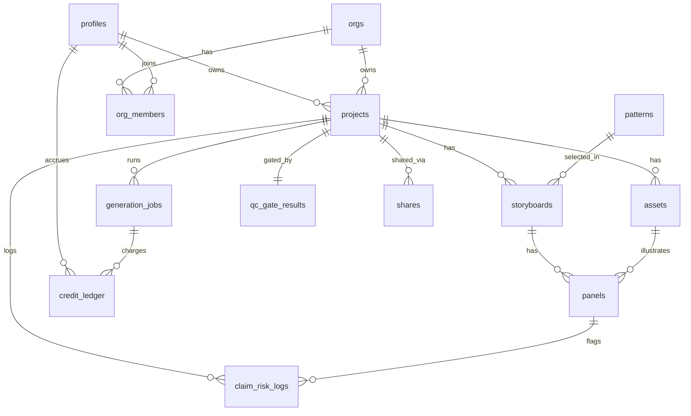

# Shonode Studio — 광고영상 스토리보드 SaaS 고도화 기획서

> **English abstract.** This document is the product plan for evolving Shonode — an open-source, vanilla-JS storyboard node canvas for AI-assisted commercial video planning — into a SaaS ("Shonode Studio", working title) that plans and generates ad-video storyboards. The AI pipeline design is grounded in two proven OpenCrab workflow assets: the 5-node *Ad Storyboard Skill Workflow* (QC gate → pattern selection → six-beat storyboard → prompt & risk → output contract) and a 14-step full production workflow (brief-to-delivery). The stack decision is incremental layering of Supabase (auth/Postgres/storage) onto the existing static-frontend + Vercel serverless architecture — a strangler-fig migration, not a rewrite. This is a planning document; implementation follows in phases described in §8.

- 문서 상태: 초안 v0.2 (2026-07-06) — `contentscoin/video-production` 대조 완료분 반영
- 대상 브랜치: `claude/ad-video-storyboard-saas-tot1xg`
- 산출물 성격: 제품/아키텍처 기획 문서 (구현 없음)
- 미확정 항목: §9 Open Questions — video-production 대조로 7건 중 5건 해소, 잔여 2건(§9.2)

---

## 0. 요약 (Executive Summary)

Shonode는 현재 "브리프 한 문단 → Gemini 단발 호출 → 컷 카드 캔버스 배치"까지 동작하는 오픈소스 프로토타입이다. 이를 **광고영상 스토리보드 기획·생성 SaaS**로 고도화한다. 핵심 차별점은 세 가지다.

1. **클레임 세이프티 / QC 게이트 내장** — 제품 리스크 분류(건기식·화장품·금융 등 고위험군), 증빙(proof) 가용성 판정, 표시·광고 규제 리스크에 대응하는 claim-safe 모드. 국내 경쟁 도구에 없는 기능.
2. **6비트 광고 서사 계약(six-beat contract) 기반 자동 스토리보드** — hook(0–3s) → tension(3–7s) → product reveal(7–12s) → demo/proof(12–20s) → joy payoff(20–26s) → CTA/memory(26–30s). 출력이 항상 광고 문법을 지키도록 스키마 수준에서 검증.
3. **노드 캔버스 → 프롬프트 블록(I2I/T2I/I2V) → 생성 잡스펙까지 단절 없는 핸드오프** — 기획 도구(Boords류)와 생성 도구(LTX Studio류) 사이의 빈 공간을 메운다.

- **포지셔닝 문장**: "AI 광고 스토리보드 스튜디오 — 브리프에서 촬영 가능한 콘티까지, 심의 걱정 없이."
- **제품명**: 오픈소스는 Shonode 유지, SaaS는 가칭 **Shonode Studio** *(네이밍은 결정 항목)*.
- **스택**: 기존 바닐라 JS 프론트 + Vercel 서버리스 유지, **Supabase(인증·Postgres·스토리지)를 점진적으로 결합**. 전면 재작성 없음.
- **수익화**: Free / Pro / Team 구독 + 스테이지별 AI 크레딧 미터링, v2에서 패턴 마켓플레이스.

### 설계 근거 (OpenCrab에서 로드한 자산)

| 자산 | 구성 | 본 기획에서의 역할 |
|---|---|---|
| Ad Storyboard Skill Workflow (5노드, active) | qc_gate → pattern_selection → storyboard_beats → prompt_and_risk → final_output_contract | **핵심 생성 엔진의 파이프라인 설계도** (§2) |
| 14단계 풀 프로덕션 워크플로우 (FMG 레퍼런스, draft) | 팩트 추출 → 마케팅 전략 → 채널 훅 → 비주얼 방향 → 내러티브(15/30/45s) → 한국어 카피+클레임 게이트 → 컷별 스토리보드 → 시네마틱 키프레임 → 프롬프트 리페어 → Runway/Seedance 잡스펙 → 후반 조립(EDL/자막/TTS) → QA regen_queue → 납품 리포트 | **v1~v2 확장 기능의 로드맵 원형** (§2 Step 5, §3) |
| 영상제작 워크플로우 팩 8종 | Seedance 2.0 프롬프팅 가이드, 시네마틱 이미지 생성 가이드, FACS 표정연기, AI 단편영화/뮤직비디오 가이드 등 | **프롬프트 블록 품질 규칙의 지식 소스** (§2 Step 4) |

---

## 1. 제품 정의 · 타깃 · 포지셔닝

### 1.1 누가 돈을 내는가 (우선순위 순)

| 순위 | 세그먼트 | 상황과 페인 | 티어 |
|---|---|---|---|
| 1 | **소형 대행사 / 프리랜서 영상 기획자** (1–10인 부티크) | 클라이언트 제안용 콘티를 시간 단위로 생산해야 함. 콘티 외주 단가 30–100만원/건 대비 월 구독이 압도적으로 저렴. 클라이언트/법무의 "이 클레임 근거 있나요?" 질문에 답해야 함 | Team |
| 2 | **SMB 브랜드 인하우스 마케터** | 스마트스토어/자사몰 상품의 15–30초 숏폼 광고를 직접 기획. 프롬프트 엔지니어가 아님 | Pro |
| 3 | **개인 크리에이터 / AI 영상 제작자** | Kling·Higgsfield·Seedance 사용자. 프롬프트 품질이 병목 | Free → Pro 전환 퍼널 |

### 1.2 Jobs-to-be-done

- "막연한 제품 설명 한 문단을 30초 광고 컷 시퀀스로 **30분 안에** 바꿔야 한다."
- "클라이언트/법무가 컷별 클레임 근거를 물어볼 때 **문서로** 답할 수 있어야 한다."
- "이미지·영상 생성 모델에 **바로 넣을 수 있는** 프롬프트가 필요하다."
- "레퍼런스 광고를 참고하되 **표절이 아니어야** 한다."

### 1.3 경쟁 비교

| 축 | Boords / StudioBinder | LTX Studio / Krea | ChatGPT 직접 프롬프팅 | **Shonode Studio** |
|---|---|---|---|---|
| 스토리보드 협업·관리 | ◎ | △ | ✕ | ○ |
| AI 기획(전략→컷 분해) | ✕ | △ (생성 위주) | △ (구조 없음) | ◎ (패턴 매트릭스 + 6비트 계약) |
| 클레임 세이프티/심의 리스크 | ✕ | ✕ | ✕ | ◎ (qc_gate + claim_risk_log) |
| 생성 모델 핸드오프(I2I/I2V 프롬프트, 잡스펙) | ✕ | ◎ (자사 생성만) | △ | ◎ (모델 중립) |
| 한국어 카피·텍스트 세이프존 | ✕ | ✕ | △ | ◎ |
| 가격 벤치마크 | Boords $32/월 | LTX $35/월 | $20/월 | §6 참조 |

---

## 2. 핵심 사용자 플로우 — OpenCrab 워크플로우 → 제품 기능 매핑

제품의 중심 UX는 **5단계 스텝퍼 + 노드 캔버스**다. 각 단계는 OpenCrab 워크플로우 노드를 제품 기능으로 번역한 것이다.

### 매핑 테이블 (OpenCrab 노드 ↔ 화면 ↔ API ↔ DB)

| OpenCrab 노드 | 제품 단계 / 화면 | API 라우트 | 주요 DB 테이블 |
|---|---|---|---|
| (14-step) fact extraction + qc_gate | Step 1 브리프 인테이크 폼 + 리스크 배지 | `POST /api/pipeline/intake` | `projects`, `qc_gate_results`, `assets(proof_doc)` |
| pattern_selection (+ 14-step 마케팅 전략/채널 훅) | Step 2 패턴 카드 3안 선택 | `POST /api/pipeline/patterns` | `patterns`, `generation_jobs` |
| storyboard_beats | Step 3 6비트 스토리보드 캔버스 (비트 레인) | `POST /api/pipeline/storyboard` | `storyboards`, `panels` |
| prompt_and_risk (+ 시네마틱/Seedance 가이드 팩) | Step 4 키프레임 프롬프트 블록 상세뷰 | `POST /api/pipeline/prompts` | `panels.prompt_block`, `claim_risk_logs` |
| final_output_contract | 전 단계 저장 포맷 + export 검증 | `POST /api/pipeline/validate` (비-LLM) | `storyboards.contract` |
| (14-step) 잡스펙·후반 조립·QA | Step 5 잡스펙 & 핸드오프 (v2) | `POST /api/generate/image`, `POST /api/generate/video-spec` | `generation_jobs`, `assets` |

### Step 1 — 브리프 인테이크

현행 "AI Director brief" 단일 텍스트박스를 **구조화 인테이크 폼**으로 확장한다.

- 입력: 제품/브랜드명, source-of-truth URL(상세페이지), 타깃, 플랫폼(릴스/쇼츠/틱톡/유튜브 프리롤), 길이(15/30/45s), 레퍼런스 이미지, **증빙자료 업로드**(인증서·시험성적서 등).
- 실행: source URL에서 팩트 추출(확정 사실/가정/조건부 클레임 분리) → **qc_gate**: 제품 리스크 분류, proof 가용성 판정, 알려진 브랜드 체크.
- UI: 인테이크 카드에 리스크 배지 — 🟢 저위험 / 🟡 증빙 필요 / 🔴 **claim-safe 모드**(고위험 + 증빙 없음 → 클레임 없는 컨셉 스켈레톤만 생성 허용).
- 규칙(워크플로우 원문 계승): 고위험 제품에 proof 없으면 claim-safe 스켈레톤만; 저위험 감각 제품에 proof 없으면 proof_experiment 패턴 선택 금지.

### Step 2 — 전략 · 패턴 선택

- **패턴 매트릭스**(제품 카테고리 × 플랫폼 × 오디언스 × desired joy × proof 가용성 × 리스크 경계)에서 크리에이티브 패턴 **3안을 카드로 제시**. 각 카드에 source_family(award / Dolphiners / hybrid) 표기.
- 부속 출력: 마케팅 전략 요약(세그먼트, 핵심 약속, proof point, KPI, 전환 경로) + 채널별 3초 훅 변형.
- 사용자는 1안 선택 또는 커스텀. 선택 결과가 Step 3의 생성 조건이 된다.

### Step 3 — 6비트 스토리보드 (캔버스 고도화)

- 선택된 패턴 → **6비트 계약**에 따라 컷들이 캔버스에 자동 배치. 30초 기준 6–8컷(1비트당 1–2컷; 14-step의 "8클립×5초"와 정합).
- **핵심 UX 신설: 비트 레인(수평 스윔레인) 오버레이** — 기존 자유 배치를 유지하되 각 패널이 비트에 소속(`panel.beat` 필드 신설).
- 비트별 검증: 각 비트 최소 1컷, demo/proof와 joy_payoff의 기능 중복 금지(워크플로우 원문 규칙).
- 15/30/45s 변형은 비트 duration 스케일링으로 파생 생성.

### Step 4 — 키프레임 프롬프트 블록

현행 i2i/t2i/i2v 프롬프트 필드를 **프롬프트 블록** 상세뷰로 확장한다.

- 블록 구성: shot size / angle / lens·depth / lighting / color / continuity lock(인물·의상·소품 일관성) / **한국어 텍스트 세이프존** / I2V start·motion·end.
- **네거티브 제약 자동 삽입**: 소스 자산·배우·대사·프레임·로고·의상·레이아웃 복제 금지 (reference-distance 가드).
- 검증(prompt_and_risk): product clarity, brand linkage, **CTA는 하나만**, claim safety, reference distance → 컷별 `claim_risk_log` 항목 생성.
- 현행 "선택 패널 재생성"은 이 단계의 **프롬프트 리페어**(일관성 락 재적용 + 실패 원인 진단) 기능으로 진화.

### Step 5 — 잡스펙 & 핸드오프 (Pro/v2)

- Runway/Seedance/Kling **잡스펙 생성**. 슬롯 바인딩 스키마는 video-production 리포에서 실증된 포맷을 채택한다 *(출처: `reference_binding.json`, `08d-master-binding-sheet.md`)*:
  - 슬롯 태그: `@이미지1`–`@이미지9`, `@비디오1`–`3`, `@오디오1`–`3` (엔진 한도: 이미지 9 / 비디오 3 / 오디오 3 / **총 12파일**, 프롬프트 3,500자)
  - 슬롯 항목: `{role, ref_tag, anchor_id, path, bindable, priority, required}` — role 예: `character_identity`, `environment_light`, `camera_motion_only`(비디오는 카메라 모션 참조 전용, 인물·배경 이식 금지 규칙 포함)
  - 클립 간 연속성: `continuity_out` 필드(다음 클립으로의 핸드오프 상태 기술)
  - 실전 슬롯 예산: 클립당 필수 이미지 2장(캐릭터+환경) + 옵션 0–2장 수준
- **클립 내부 몽타주 패턴**: 6비트 계약(서사 레벨)과 별도로, 클립 1개 = 5비트 몽타주(비트당 ~2초 하드컷, 비트마다 샷사이즈 변경) 규칙을 잡스펙에 포함 *(출처: `09-keyframe-shot-strategy.md` — "5비트만으로 렌더 실패" 후 25샷 스토리보드 PNG 바인딩으로 진화한 renewal-v2 교훈 포함)*.
- 키프레임 이미지 **실제 생성**(크레딧 차감). 프롬프트는 CRAFT 프레임워크(Context/Reference/Action/Framing/Tone) + 공통 `lock_suffix`(브랜드 팔레트 + 유니버설 네거티브) 배치 매니페스트 `{id, output, seed}` 포맷 *(출처: `08c-master-prompt-sheet.md`, `batch1-manifest.json`)*.
- 후반 지시서 export: **오디오 레이어 분리 원칙** — 생성 엔진은 SFX만, BGM(Suno류)·VO(TTS)·자막/수퍼는 조립 단계에서 레이어링 *(출처: `renewal-v2/05-suno-bgm-brief.md`)*. EDL, 자막(ASS/SRT), 로드니스 타깃, AI 고지 프레임.
- **regen_queue QA 보드**: 문제 컷에 플래그 → "증상 → 1줄 수정 → 재생성 1회" 테이블 방식 *(출처: `10-seedance-step-by-step-guide.md`의 per-clip fix 테이블)*.
- **엔진 연동 현실**: Seedance는 현재 수동 UI(Dreamina/CapCut) 중심으로 공개 API가 검증되지 않았다 *(출처: `07-clip01-trial-run.md` §6 "실행 스크립트 없음, 수동 UI만 가능")*. 따라서 v2 커넥터는 ① **잡스펙 export(수동 UI용 복붙 킷)** 를 기본으로 하고 ② API 가용 엔진(Runway 등)만 직접 호출을 붙이는 2단 전략으로 한다.

### 최종 산출물 스키마 = final_output_contract

```json
{
  "intake": { "brand": "…", "source_url": "…", "risk_class": "low|proof_required|high", "proof_assets": [] },
  "selected_pattern": { "id": "…", "source_family": "award|dolphiners|hybrid" },
  "storyboard": [ { "beat": "hook", "cut": 1, "duration_ms": 3000, "prompt_block": { } } ],
  "cta": { "text": "…", "single_action": true },
  "required_inputs": [],
  "quality_gates": { "six_beat": true, "claim_safety": true, "one_cta": true },
  "reference_distance_summary": { }
}
```

이 스키마가 클라우드 저장 포맷의 핵심이자 PDF/공유 링크 export의 데이터 소스다.

---

## 3. 티어 · 페이즈별 기능 스펙

### 3.1 티어

> 가격은 **검증 대상 가설**이다 (벤치마크: Boords $32/월, LTX Studio $35/월, 콘티 외주 30–100만원/건).

| 기능 | Free | Pro ₩29,000/월 | Team ₩89,000/월·5석 (+₩15,000/추가석) |
|---|---|---|---|
| 프로젝트 수 | 클라우드 3개 + 로컬 무제한 | 무제한 | 무제한 + 조직 워크스페이스 |
| AI 스토리보드 생성 | 월 10회, export 워터마크 | 월 200회 상당 크레딧 | 풀 크레딧, 조직 합산 과금 |
| QC 게이트 / 클레임 로그 | 리스크 배지만 | 전체 claim_risk_log + 리포트 | + 승인 워크플로(검토자 지정) |
| 패턴 라이브러리 | 기본 5종 | 전체 매트릭스 + hybrid | + 팀 커스텀 패턴 |
| 키프레임 이미지 생성 | ✕ | 크레딧 차감 | 크레딧 차감 |
| 잡스펙 / EDL / 자막 export | ✕ | ○ | ○ |
| 공유 링크 / 코멘트 | 보기 전용 | ○ | 실시간 협업(v2) |
| BYO API key | ○ (로컬 프록시 모드) | ○ (크레딧 미차감) | 조직 키 |

### 3.2 페이즈

| Phase | 기간(1인 풀타임 환산) | 범위 | Exit criteria |
|---|---|---|---|
| **0. 정지작업** | 1–2주 | shotboard-ai.js 중복 함수(~350L 데드코드) 제거, i2i/i2t 네이밍 정리, `shonode-workspace-v2` 스냅샷 스키마(beat/claimLog/pattern 필드 + v1 마이그레이터), docs/ 구조 | `npm run check` 통과, v1 스냅샷 왕복 호환 |
| **1. MVP** | 6–8주 | Supabase auth(구글/이메일) + 클라우드 프로젝트(snapshot jsonb) + Storage, 로컬→클라우드 마이그레이션 UX, 인테이크 폼 + qc_gate, 6비트 생성 파이프라인 + 비트 레인 UI, 클레임 배지, 크레딧 미터링 + 결제(Free/Pro), 클로즈드 베타 | 주간 생성 프로젝트 50+, 온보딩 완주율 |
| **2. v1** | 8–10주 | 패턴 선택 UI + 매트릭스 DB, 프롬프트 블록 + prompt_and_risk, 키프레임 이미지 생성, claim 리포트 PDF, 15/30/45s 변형, 공유 링크, Team 티어 | Free→Pro 전환 3%+ |
| **3. v2** | 10–12주 | 비디오 잡스펙 커넥터(Runway/Seedance/Kling), regen_queue QA 보드, 후반 핸드오프(EDL/ASS/TTS/BGM), 패턴 마켓플레이스, reverse-ingest(익명화 lesson 환류), 실시간 협업 | 마켓플레이스 GMV, 리텐션 |

결제 PG는 국내 타깃 기준 **토스페이먼츠 우선, Stripe 병행 검토** *(결정 항목)*.

---

## 4. 아키텍처 — Strangler-fig 점진 레이어링

**원칙: 재작성이 아니라 감싸기.** 정적 바닐라 JS 프론트 + Vercel 서버리스를 유지하고, Supabase를 단계적으로 결합한다. 기존 로컬 모드(로그인 없음, localStorage/.shonode)는 **오픈소스 프로토타입으로 영구 보존** — acquisition funnel이자 락인 방지 장치다.

### 4.1 레이어링 순서

1. **인증**: 신규 모듈 `auth-client.js` (Supabase JS를 CDN ESM으로 로드 — 빌드 스텝 없음 유지). 기존 파일에는 훅 포인트만 추가. 세션 JWT를 `/api/*` 호출의 `Authorization` 헤더에 첨부. 서버 측 JWT 검증은 공유 모듈 `api/_lib/auth.js`(storyboard-proxy.js 패턴 답습).
2. **클라우드 프로젝트 저장**: 현행 `shonode-workspace-v1` JSON 스냅샷을 1급 시민으로 승격 — `projects.snapshot jsonb`에 통째 저장(MVP)한 뒤, v1 페이즈에서 panels를 정규화 테이블로 이중 기록. 마이그레이션 UX: 로그인 시 "브라우저에 저장된 N개 프로젝트를 클라우드로 옮길까요?" 원클릭. `.shonode` export/import 영구 유지. 레퍼런스 이미지(dataUrl)는 **Supabase Storage로 이전**하고 스냅샷에는 storage path 참조 — localStorage 5MB 한계 해소가 즉각적 사용자 가치.
3. **파이프라인 서버리스 라우트** (Vercel functions, `api/storyboard.js` 패턴):
   - `POST /api/pipeline/intake` — 팩트 추출 + qc_gate (LLM 1–2회)
   - `POST /api/pipeline/patterns` — 패턴 선택 (매트릭스는 `patterns` 테이블에서 로드)
   - `POST /api/pipeline/storyboard` — 6비트 생성 (현행 `/api/storyboard`의 진화; responseJsonSchema를 final_output_contract 정합으로 확장)
   - `POST /api/pipeline/prompts` — prompt_and_risk + 리페어
   - `POST /api/pipeline/validate` — 출력 계약 검증 (비-LLM, 순수 스키마 검사)
   - `POST /api/generate/image`, `POST /api/generate/video-spec` (v1/v2)
   - `GET /api/config` — 클라이언트에 SUPABASE_URL/ANON_KEY 주입(빌드 치환이 없으므로)
   - 프로젝트 CRUD 라우트는 **만들지 않는다** — Supabase 클라이언트 직결 + RLS. 서버리스는 LLM 호출·과금이 걸린 작업 전용.
4. **오케스트레이션**: MVP는 클라이언트가 스텝별로 호출(진행 UI 표시). v1에서 `generation_jobs` 테이블 + Supabase Edge Function/큐 기반 서버 오케스트레이션 검토. 프로젝트 상태는 video-production에서 실증된 **게이트 모델**을 차용 — G0 기획 LOCK → G1 키프레임 → G2 트라이얼 1클립+QA → G3 전체 생성 → G4 조립·납품 *(출처: `08-production-master-index.md` §2)*. 각 게이트에 pass 조건과 담당(휴먼 승인 여부)을 명시하고, QA FAIL 시에도 사용자 재량으로 다음 게이트 진행 가능(비차단 오버라이드, 로그 기록).
5. **조립(어셈블리) 워커 — v2**: ffmpeg가 아니라 **Remotion**(React 기반 프로그래매틱 비디오)을 조립 엔진으로 채택한다 *(출처: video-production `remotion/` 스캐폴드 — 클립 임포트·자막·가격 카드·CTA 컴포지션 스펙이 이미 Remotion 기준으로 정의됨)*. 실행 위치는 Vercel 서버리스 불가 → **Remotion Lambda 또는 별도 렌더 워커**. 자막/수퍼는 ASS/SRT 파일이 아닌 Remotion 컴포지션 레이어로 우선 처리하고, 파일 export는 보조 산출물로 제공.
6. **크레딧/미터링**: `credit_ledger` + 원자적 Postgres 함수. 호출 **전 사전 차감(escrow)**, 실패 시 환급. **BYO 키**: Supabase Vault에 암호화 저장 후 서버 측에서만 사용(키를 클라이언트에 두지 않는 현행 철학 유지). Free는 metered 전용. 셀프호스트 OSS 모드(.env GEMINI_API_KEY)는 계속 지원 = 오픈코어.

### 4.2 배포 토폴로지

- Vercel: 정적 프론트 + `api/` 서버리스 함수 (zero-config 유지)
- Supabase(managed): Auth, Postgres(+RLS), Storage(레퍼런스/키프레임/증빙 문서), Vault(BYO 키)
- 환경변수: `SUPABASE_URL`, `SUPABASE_ANON_KEY`(클라이언트는 `/api/config` 경유), `SUPABASE_SERVICE_ROLE_KEY`, `GEMINI_API_KEY`, 결제 키

### 4.3 기술 부채 선결 조건 (Phase 0)

| 항목 | 내용 | 순서 의존성 |
|---|---|---|
| 중복 함수 제거 | shotboard-ai.js의 normalizePlan / applyStoryboardPlan / buildLocalStoryboardPlan 2중 정의(~350L 데드코드) | 클라우드 저장 도입 전 필수 |
| 네이밍 정리 | AI 스키마 `i2iPrompt` vs 패널 `i2tPrompt` 혼재 해소 | workspace-v2 스키마 확정 전 필수 |
| workspace-v2 | `shonode-workspace-v2`: beat, claimLog, pattern 필드 추가 + v1 마이그레이터 | snapshot jsonb 저장의 전제 |
| 모듈 경계 규율 | 신규 기능은 신규 파일로, ESM 전환 로드맵. **빌드 스텝 도입 트리거 = 실시간 협업 착수 시점** | — |

---

## 5. 데이터 모델

### 5.1 ERD



### 5.2 테이블 정의 (요약)

| 테이블 | 핵심 컬럼 | 비고 |
|---|---|---|
| `profiles` | auth.users 참조, display_name, locale, plan | Supabase Auth 연동 |
| `orgs` / `org_members` | name, owner_id, plan, seat_count / role(owner·admin·editor·reviewer·viewer) | Team 티어 |
| `projects` | owner_id, org_id?, title, brand_name, source_url, **risk_class**(low·proof_required·high), status, **snapshot jsonb**(shonode-workspace-v2), snapshot_version, deleted_at | MVP는 snapshot 단일 소스 |
| `storyboards` | project_id, variant(15s·30s·45s), pattern_id, **contract jsonb**(final_output_contract), status | 변형별 1행 |
| `panels` | storyboard_id, **beat**(hook·tension·reveal·proof·joy·cta), order_index, scene_title, duration_ms, caption, **prompt_block jsonb**(CRAFT + negative + locks), **bindings jsonb**(슬롯 배열: role/ref_tag/anchor_id/asset_id/bindable/priority/required + continuity_out — video-production `reference_binding.json` 스키마 채택), canvas jsonb(x,y,z), image_asset_id?, video_asset_id? | v1에서 정규화 이중 기록 시작 |
| `assets` | project_id, kind(reference·keyframe·video·**proof_doc**), storage_path, mime, width, height, source(upload·generated), generation_job_id? | proof_doc은 private bucket |
| `generation_jobs` | project_id, user_id, **stage**(intake·patterns·storyboard·prompts·image·video_spec), model, input/output jsonb, credit_cost, status, error, timings | 원가 대시보드 소스 |
| `claim_risk_logs` | project_id, panel_id?, claim_text, risk_level, proof_asset_id?, **ruling**(allowed·claim_safe_rewrite·blocked), reviewer_id?, resolved_at | qc_gate + prompt_and_risk 산출. 생성물 QA의 Legal 행(예: 생성 영상에 판독 가능한 타사 브랜드 텍스트 노출 → FAIL)도 이 테이블에 기록 — video-production G2 QA에서 실증된 패턴 |
| `qc_gate_results` | project_id, traceability jsonb, product_risk, proof_availability, forbidden_patterns[], reference_distance jsonb | 프로젝트당 1행(재실행 시 갱신) |
| `patterns` | name, **source_family**(award·dolphiners·hybrid), matrix_keys jsonb(category/platform/audience/joy/proof/risk), beat_template jsonb, is_public, org_id?(커스텀), price?(마켓) | 마켓플레이스 대비 |
| `credit_ledger` | user_id/org_id, delta, reason(stage·purchase·refund·plan_grant), job_id?, balance_after | append-only |
| `shares` | project_id, token, mode(view·comment), expires_at | 공유 링크 |

**RLS**: 전 테이블 owner/org-member 기준. `patterns.is_public = true`만 익명 read 허용. snapshot(jsonb) ↔ 정규화 테이블 전략: MVP는 jsonb 단일 → v1에서 panels 정규화 후 jsonb는 캔버스 뷰 상태 전용으로 축소.

---

## 6. 수익화

1. **구독** (§3.1 표): Free / Pro ₩29,000 / Team ₩89,000·5석. 가격은 가설로 표기, 베타에서 검증.
2. **AI 크레딧**: 스테이지별 정액 — intake 1cr, patterns 1cr, storyboard 3cr, prompts 0.5cr/컷, 이미지 생성 2cr/장, video spec 1cr. Gemini Flash 원가 기준 **마진 70%+ 설계**. 크레딧 팩 추가 구매 ₩11,000/100cr. BYO 키 사용 시 LLM 스테이지 크레딧 면제(플랫폼 기능은 구독 과금).
   - **물량 기준점** *(video-production 실측 단위)*: 50초 B2B 광고 1편 = 스틸 26–36장(마스터·플레이트·스토리보드 프레임) + 비디오 클립 ~5개 + **상당한 재생성 churn**(동일 앵커 3회 재생성 사례). 크레딧 설계는 1편당 스틸 ~40장·클립 ~8회 생성을 표준 소비량으로 가정하고, QA FAIL 재생성을 크레딧 소모의 1급 시나리오로 취급한다(재생성 할인 또는 escrow 부분 환급 검토).
3. **패턴 마켓플레이스 (v2)**: 검증된 패턴 템플릿(비트 템플릿 + 프롬프트 스타일) 판매, 제작자 70/30 배분. Team 커스텀 패턴 → 공개 판매 전환 퍼널.
4. **오픈코어 경계**:

| MIT (오픈소스 유지) | SaaS 전용 |
|---|---|
| 노드 캔버스, 로컬 저장(.shonode), BYO 프록시(단일 `/api/storyboard`), 셀프호스트 모드 | 파이프라인 QC(qc_gate/prompt_and_risk), 패턴 매트릭스 데이터, 클라우드 저장/동기화, 협업, 크레딧/결제, 마켓플레이스 |

---

## 7. 리스크 · 가드레일

| 리스크 | 가드레일 |
|---|---|
| **클레임 세이프티 오판** (LLM 판정 한계) | claim_risk_log에 "AI 사전점검이며 법률 자문 아님" 고지 고정. 고위험 카테고리(의료·건기식·금융)는 **하드코딩 룰 테이블** 병행. Team 티어 인간 검토 워크플로(reviewer 지정) |
| **저작권 / reference-distance** | 업로드 레퍼런스에 네거티브 제약 자동 삽입. reference_distance_summary를 export 리포트에 포함(대행사가 클라이언트 제출 가능한 근거 문서). 유명 브랜드 소재 감지 시 경고 |
| **API 키 / 비용 어뷰징** | 현행 origin allowlist에 더해: JWT 필수화, per-user rate limit(Postgres 카운터 → 필요 시 Upstash), 크레딧 **사전 차감(escrow)**, inline 이미지 상한 축소 + Storage 경유 전환, 이상 사용 알림, Free 티어 기기/IP 시그널 어뷰즈 감지 |
| **LLM 비용 통제** | 스테이지별 max token/이미지 수 상한, 모델 폴백(Flash → Flash-lite), generation_jobs 기반 원가 대시보드, 월 상한 알림 |
| **데이터/프라이버시** | 증빙 문서(시험성적서 등)는 private bucket + 서명 URL + 보존기간 정책. **로컬 모드 사용자 데이터는 절대 서버 전송 없음**(문서화·고지) |
| **바닐라 JS 규모 한계** | 신규 기능 = 신규 파일 원칙, ESM 전환 로드맵. 빌드 스텝 도입 트리거: 실시간 협업 착수 시 |

---

## 8. 로드맵 요약

```
Phase 0 (1–2주)   정지작업: 데드코드 제거, workspace-v2, 네이밍 정리
Phase 1 (6–8주)   MVP: Supabase auth·저장·Storage, 인테이크+qc_gate,
                  6비트 생성+비트 레인, 크레딧·결제, 클로즈드 베타
Phase 2 (8–10주)  v1: 패턴 UI, 프롬프트 블록+prompt_and_risk, 키프레임 생성,
                  claim 리포트 PDF, 변형, 공유 링크, Team
Phase 3 (10–12주) v2: 잡스펙 커넥터, regen_queue QA, 후반 핸드오프,
                  마켓플레이스, reverse-ingest, 실시간 협업
```

KPI 게이트: MVP→v1 = 주간 생성 프로젝트 50+ / Free→Pro 전환 3%+.

---

## 9. Open Questions — `contentscoin/video-production` 대조 결과

> 상태: **대조 완료** (2026-07-06, 리포 커밋 `37c5210` 기준). 7건 중 5건 해소·본문 반영, 2건 잔여.

### 9.1 해소된 항목

| # | 질문 | 결론 | 반영 위치 |
|---|---|---|---|
| 1 | 파이프라인 canonical 우선순위 | 리포의 실제 파이프라인은 14-step 선형이 아니라 **G0–G4 게이트 모델**. 기획 절반(스토리보드·키프레임·바인딩)은 실증 완료, 생성→조립→납품 절반은 수동/미실행. **스토리보드 생성 로직 = OpenCrab 5노드 워크플로우, 프로젝트 상태 관리 = 리포의 게이트 모델**로 역할 분담 | §2, §4.1-4 |
| 2 | 잡스펙 슬롯 문법 | `@이미지1~9`/`@비디오1~3`/`@오디오1~3`, 총 12파일·프롬프트 3,500자 한도, 슬롯 = {role, ref_tag, anchor_id, path, bindable, priority, required} + continuity_out. `reference_binding.json` 스키마를 그대로 채택 | §2 Step 5, §5 panels.bindings |
| 3(부분) | Seedance 연동 방식 | 공개 API 미검증, 수동 UI(Dreamina/CapCut)만 실증 → 커넥터는 "잡스펙 export 우선 + API 가용 엔진만 직접 호출" 2단 전략 | §2 Step 5 |
| 4 | claim/QA 구조 재사용 | LOCK 컨벤션(기획·네이밍·프롬프트 freeze), per-shot PASS/FAIL 체크리스트, QA Legal 행(브랜드 텍스트 노출 FAIL 실사례), "증상→1줄 수정→재생성 1회" regen 테이블 — 모두 재사용. 비차단 오버라이드(FAIL에도 사용자 재량 진행+로그) 포함 | §5 claim_risk_logs, §2 Step 5 |
| 5 | 조립 파이프라인 위치 | **ffmpeg 아님 — Remotion** (React 컴포지션: 클립 임포트·자막·가격카드·CTA). 실행은 Remotion Lambda 또는 별도 렌더 워커. 오디오는 엔진 SFX / Suno BGM / TTS VO / Remotion 수퍼로 레이어 분리 | §4.1-5 |

### 9.2 잔여 항목

| # | 질문 | 현황 |
|---|---|---|
| 6 | 패턴 매트릭스 실데이터(award/Dolphiners)의 저작권 상태 | 리포에는 해당 데이터 없음(OpenCrab 팩 측 자산). 리포에서 확인된 원칙: 참조 팩 구조 "미복제" 명시, 네거티브 프롬프트로 상표 안전 처리. **마켓플레이스 출시 전 OpenCrab 팩 라이선스 확인 필요** |
| 7 | 실측 원가 → 크레딧 가격 검증 | 금액 데이터 없음(이미지 생성은 무과금 경로 사용, 유료 API 미가동). 단위 물량은 확보되어 §6에 반영. **베타 기간 generation_jobs 원가 대시보드로 실측 후 가격 확정** |

### 9.3 대조에서 추가로 얻은 재사용 자산

| 자산 | 출처 | SaaS 반영 |
|---|---|---|
| 25행 샷 매트릭스 스키마(클립/씬/샷ID/비트/카메라/키프레임/@바인딩 컬럼) | `08a-master-shot-matrix.md` | panels 정규화 컬럼·캔버스 표 뷰의 원형 |
| CRAFT 프롬프트 프레임워크 + lock_suffix 배치 매니페스트 | `08c`, `batch1-manifest.json` | Step 4 프롬프트 블록 템플릿 |
| 자산 네이밍 체계(`{BRAND}-{MCHAR\|MBG\|SB\|PLATE}-*`) + v1→v2 마이그레이션 맵 | `renewal-v2/04` | assets 테이블 네이밍 규칙 |
| "클립=5비트 몽타주" 규칙과 렌더 실패 교훈(추상 앵커 → 샷별 스토리보드 PNG 바인딩) | `09`, `renewal-v2/00` | Step 5 잡스펙 기본 규칙 |
| 오디오 레이어 분리(엔진 SFX/Suno BGM/VO/Remotion 수퍼) | `renewal-v2/05` | Step 5 후반 지시서 |

---

## 부록 A. 현행 코드 기준점

| 현행 자산 | 위치 | 고도화에서의 역할 |
|---|---|---|
| 워크스페이스 스냅샷 `shonode-workspace-v1` | `shotboard-ai.js` (createWorkspaceExportSnapshot) | workspace-v2의 베이스, `projects.snapshot` 포맷 |
| Gemini 요청·responseJsonSchema (cuts: sceneTitle/durationLabel/caption/i2iPrompt/t2iPrompt/i2vStart·Motion·EndPrompt) | `ai-client.js` | `/api/pipeline/storyboard` 응답 계약의 베이스라인 — final_output_contract로 확장 |
| origin allowlist + 요청 검증 | `storyboard-proxy.js` | 신규 서버리스 라우트의 공통 미들웨어 원형 |
| 패널·프로젝트 모델, localStorage/IndexedDB 키 | `script.js` | 로컬→클라우드 마이그레이션 UX의 소스 목록 |
| 선택 패널 재생성 플로우 | `ai-client.js` / `shotboard-ai.js` | Step 4 프롬프트 리페어 및 regen_queue의 원형 |
